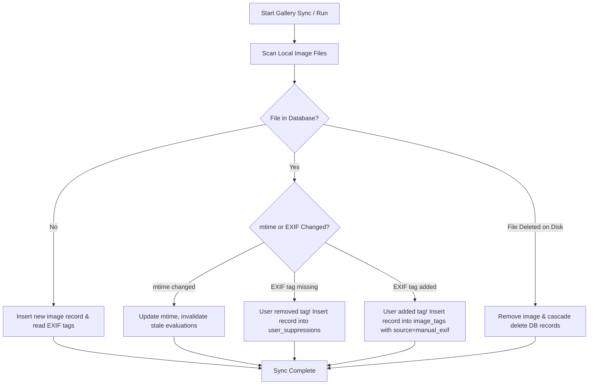

# Design Spec: Robust State Tracking & Self-Healing Sync Engine for Exif-Tagger

**Date**: 2026-08-07  
**Author**: Antigravity AI  
**Status**: Draft (Approved in Concept)

---

## 1. Executive Summary

`exif-tagger` currently uses a simple JSON checkpoint file (`.exif-tagger-checkpoint`) tracking whole-image completion status. This model fails in real-world large photo gallery workflows involving subfolder runs, tag description updates, threshold tweaks, false-positive tag removal, manual EXIF tagging, and scheduled batch runs.

This specification outlines a **Unified Database State & Self-Healing Sync Engine**. It replaces the JSON checkpoint with a granular, normalized relational state engine in SQLite, structured with clean Data Access Object (DAO) abstraction so it can easily swap to MySQL or PostgreSQL in the future.

---

## 2. Key Requirements & Real-World Scenarios

1. **Granular (Image, Tag) Tracking**: Track evaluation status per tag (not per image), storing description hashes, scores, reasons, and timestamp snapshots.
2. **Subfolder Scoping & Rate-Limiting**: Efficiently query and process images within any subfolder path, with support for batch caps (e.g., `LIMIT 100`).
3. **Resilient Job Interruption**: Atomic database transactions per processed image guarantee clean resume on abort or power failure.
4. **Smart Re-evaluation (Zero-Cost Local Threshold Updates)**:
   - If a tag's **description** changes $\rightarrow$ queue re-evaluation via Vision AI.
   - If only a tag's **threshold** changes $\rightarrow$ re-evaluate confidence scores locally without calling the Vision AI API.
5. **False Positive & User Suppression Tracking**:
   - If a user manually removes a tag (via WebUI or external EXIF editors like Windows Explorer), record an explicit record in `user_suppressions`.
   - Automated runs will **never** re-add a suppressed tag unless explicitly forced.
6. **External Tag Detection**:
   - Manually added EXIF `XPTags` are tracked with `source='manual_exif'` or `'manual_ui'` to prevent accidental deletion during automated cleanups.
7. **Gallery Self-Healing**:
   - Detect deleted, renamed, or modified image files (`mtime` / hash changes).
   - Invalidate evaluation cache when file content changes.
8. **Pluggable Database Adapter Architecture**:
   - Abstract database operations through an interface to allow seamless transition to MySQL or PostgreSQL in future releases.

---

## 3. Database Architecture & Schema

### 3.1 Pluggable Database Abstraction Layer (`db_adapter`)
To support switching from SQLite to MySQL / PostgreSQL:
- Implement a `DatabaseAdapter` abstract class defining methods like `connect()`, `init_schema()`, `get_unprocessed_images()`, `record_evaluation()`, `add_suppression()`, etc.
- Implement `SQLiteAdapter` as the primary implementation.

### 3.2 Relational Schema Definition

```sql
-- 1. Images table (Extended from existing db.py)
CREATE TABLE IF NOT EXISTS images (
    id INTEGER PRIMARY KEY AUTOINCREMENT,
    file_path TEXT UNIQUE NOT NULL,
    filename TEXT NOT NULL,
    relative_path TEXT NOT NULL,
    last_modified REAL NOT NULL,
    file_hash TEXT,
    indexed_at TEXT NOT NULL
);

-- 2. Tag Definitions table (Tracks active tag specs and content hashes)
CREATE TABLE IF NOT EXISTS tag_definitions (
    tag_name TEXT PRIMARY KEY,
    description TEXT NOT NULL,
    description_hash TEXT NOT NULL,
    threshold REAL NOT NULL,
    updated_at TEXT NOT NULL
);

-- 3. Image Tags table (Current active EXIF / DB tags on an image)
CREATE TABLE IF NOT EXISTS image_tags (
    image_id INTEGER NOT NULL,
    tag_name TEXT NOT NULL,
    source TEXT NOT NULL DEFAULT 'model', -- 'model', 'manual_ui', 'manual_exif'
    added_at TEXT NOT NULL,
    PRIMARY KEY (image_id, tag_name),
    FOREIGN KEY(image_id) REFERENCES images(id) ON DELETE CASCADE
);

-- 4. Tag Evaluations table (Granular AI vision model evaluation history)
CREATE TABLE IF NOT EXISTS tag_evaluations (
    id INTEGER PRIMARY KEY AUTOINCREMENT,
    image_id INTEGER NOT NULL,
    tag_name TEXT NOT NULL,
    description_hash TEXT NOT NULL,
    status TEXT NOT NULL, -- 'matched', 'not_matched', 'error'
    score REAL NOT NULL DEFAULT 0.0,
    reason TEXT,
    model_name TEXT NOT NULL,
    evaluated_at TEXT NOT NULL,
    image_mtime REAL NOT NULL,
    FOREIGN KEY(image_id) REFERENCES images(id) ON DELETE CASCADE,
    UNIQUE(image_id, tag_name)
);

-- 5. User Suppressions table (Blacklisted / false-positive tags per image)
CREATE TABLE IF NOT EXISTS user_suppressions (
    image_id INTEGER NOT NULL,
    tag_name TEXT NOT NULL,
    suppressed_at TEXT NOT NULL,
    reason TEXT DEFAULT 'manual_removal',
    PRIMARY KEY (image_id, tag_name),
    FOREIGN KEY(image_id) REFERENCES images(id) ON DELETE CASCADE
);

-- Indices for rapid querying
CREATE INDEX IF NOT EXISTS idx_images_relative_path ON images(relative_path);
CREATE INDEX IF NOT EXISTS idx_evaluations_image_tag ON tag_evaluations(image_id, tag_name);
CREATE INDEX IF NOT EXISTS idx_suppressions_image_tag ON user_suppressions(image_id, tag_name);
```

---

## 4. Self-Healing & Synchronization Workflows



### 4.1 Sync Logic for Manual Tag Removals (False Positives)
When `sync_gallery_index()` runs:
1. Fetch all `(image_id, tag_name)` currently stored in `image_tags` where `source='model'`.
2. Read EXIF `XPTags` directly from image file.
3. If a tag was previously recorded in `image_tags` (from AI model) but is missing from EXIF `XPTags`:
   - Insert `(image_id, tag_name)` into `user_suppressions`.
   - Remove tag from `image_tags`.
   - Log: *"Detected manual EXIF removal of tag '{tag_name}' on '{file_path}'. Created user suppression."*

### 4.2 Queueing Work for Tagging Sessions
When starting a tagging job for target directory `target_dir` and active tag list `tags`:
1. Find all images matching `relative_path LIKE 'target_dir/%'`.
2. Exclude images/tags where `(image_id, tag_name)` exists in `user_suppressions`.
3. Filter out `(image_id, tag_name)` pairs where `tag_evaluations` has:
   - `description_hash == current_tag_description_hash` AND
   - `image_mtime == current_image_mtime`.
4. **Local Threshold Check Optimization**:
   - If `description_hash` matches, but tag `threshold` in `config.yaml` was changed:
     - Check if `score >= new_threshold`.
     - If true: add to `image_tags` and EXIF.
     - If false: remove from `image_tags` and EXIF.
     - *No API call required!*
5. Return candidate images that have at least 1 missing/stale tag evaluation.

---

## 5. Backward Compatibility & Migration

- Automatically detect `.exif-tagger-checkpoint` JSON file if present on run.
- Migrate JSON entries into `tag_evaluations` and `image_tags` in SQLite.
- Safely remove or archive legacy `.exif-tagger-checkpoint` after successful migration.

---

## 6. Verification Plan

1. **Unit Tests (`tests/test_db_state.py`)**:
   - Test subfolder query filtering.
   - Test suppression creation on manual tag deletion.
   - Test zero-cost local threshold updates.
   - Test job abort and resume without duplicate evaluations.
2. **Integration Tests (`tests/test_pipeline_engine.py`)**:
   - Simulate adding a new tag, modifying description, and threshold changes.
   - Verify migration of legacy JSON checkpoints.
